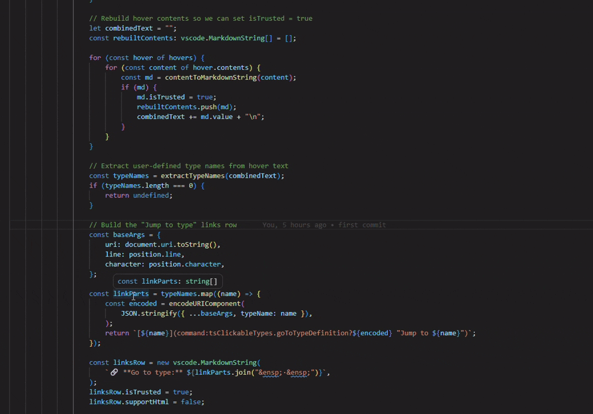

# TypeScript Clickable Types

[](https://marketplace.visualstudio.com/items?itemName=profanterdev.ts-clickable-types)
[](https://marketplace.visualstudio.com/items?itemName=profanterdev.ts-clickable-types)
[](https://opensource.org/licenses/MIT)

> Adds **clickable type links** to TypeScript hover tooltips in VS Code — jump to any type definition like in Visual Studio.

---

## The Problem

In **Visual Studio**, when you hover over a variable, the type name in the tooltip is clickable and jumps straight to its definition. In **VS Code**, the hover tooltip is plain text — you have to right-click and choose "Go to Type Definition" as a separate step.

## The Solution

This extension appends a **🔗 Go to type** row at the bottom of every TypeScript hover tooltip with a clickable link for each detected type.



Clicking the type name jumps straight to wherever it is defined — whether that's an `interface`, `type` alias, `class`, or `enum`.

---

## Features

- ✅ Works with interfaces, type aliases, classes, enums
- ✅ Handles generic types like `Cut[]`, `Map<string, Cut>`, `Promise<Cut>`
- ✅ Supports `.ts`, `.tsx`, `.js`, `.jsx` files
- ✅ Filters out built-in types (no noise from `Array`, `Promise`, `Record`, etc.)
- ✅ Falls back to workspace symbol search if direct lookup fails
- ✅ Zero configuration needed

---

## Usage

1. Open any TypeScript file
2. Hover over a variable, parameter, or return type
3. Click the type name in the **🔗 Go to type** row at the bottom of the tooltip

---

## Supported Languages

| Language                  | Supported |
| ------------------------- | --------- |
| TypeScript (`.ts`)        | ✅        |
| TypeScript React (`.tsx`) | ✅        |
| JavaScript (`.js`)        | ✅        |
| JavaScript React (`.jsx`) | ✅        |

---

## Requirements

- VS Code `1.74.0` or later
- TypeScript language server active in your workspace

---

## Extension Settings

| Setting | Type | Default | Description |
|---|---|---|---|
| `tsClickableTypes.excludeTypes` | `string[]` | `[]` | Additional type names to exclude from clickable links. Merged with the built-in exclusion list. |

**Example** — add to your `settings.json` to suppress links for specific types:

```json
"tsClickableTypes.excludeTypes": ["Component", "Ref", "FC"]
```

---

## Known Limitations

- Only detects **PascalCase** type names (which covers virtually all user-defined types by convention)
- Types defined only in `node_modules` without workspace sources may not be jumpable

---

## Development

```bash
# Install dependencies
npm install

# Run tests
npm test

# Compile
npm run compile

# Package as .vsix
npm run package
```

## Contributing

Found a bug or have a feature request? Open an issue on [GitHub](https://github.com/marpro200/ts-clickable-types).

Pull requests are welcome!

---

## License

[MIT](LICENSE)
